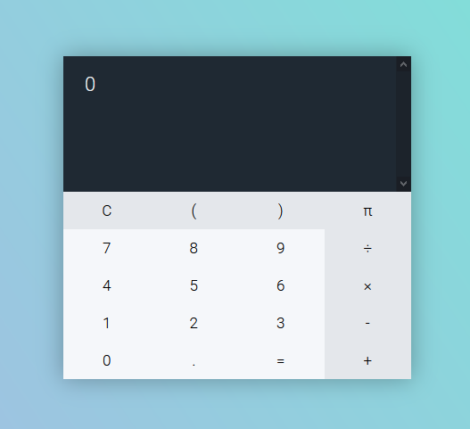

# calculator

Hey there ! :smile:

This repo isn't a fork of [this other one](https://github.com/kevin-powell/calculator), but the HTML & CSS is based on it. 
If you follow the link, you'll find the YT series with Kevin Powell & Zell making a calculator.
I remade the JavaScript completely.
My calculator is an extension of it, and supports now π and parentheses, as well as chained expressions.

Don't expect from me PRO javascript, this is a personal project.

> Note : this is vanilla JS

## Overview


## How to Build


First, clone the repo :
> Choose one of the following options : 
```bash
git clone https://github.com/MartinHeywang/calculator
gh repo clone MartinHeywang/calculator
```

> You may want to fork this repo before if you're willing to edit the code.

Then, serve it on your PC/Mac :
```bash
npm install -g serve
cd path/to/project
serve .
```

## Issues

I didn't tested the code a lot. (oups...)
When using this calculator, you might front unexpected results. :(

If that's the case, don't be shy and create an issue [here](https://github.com/MartinHeywang/calculator/issues/new).

You may want to fix the problem by yourself : you can create a PR too.

## License
MIT